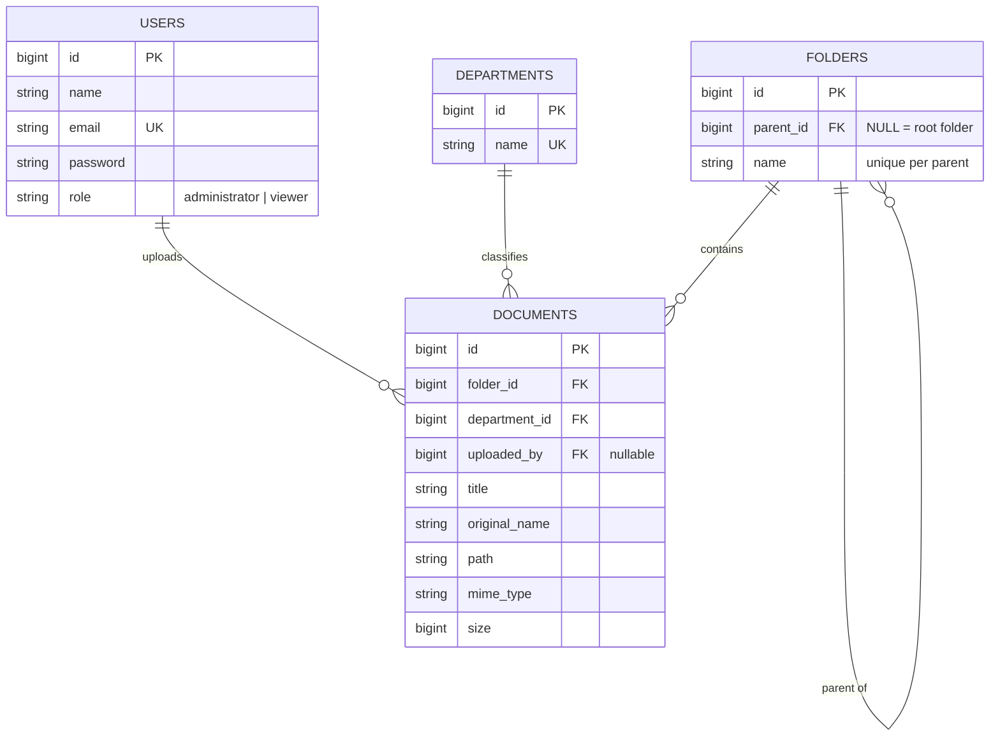

# File Management System (FMS)

Aplikasi manajemen dokumen perusahaan dengan struktur folder bertingkat (hierarchical), upload dan pengelolaan file,
serta hak akses berdasarkan peran (Administrator dan Viewer).

Dibuat untuk **Technical Test – Full Stack Laravel Developer**.

## Teknologi

| Layer    | Teknologi                                                  |
| -------- | ---------------------------------------------------------- |
| Backend  | Laravel 11                                                 |
| Frontend | Vue 3 (via Inertia.js, starter kit Laravel Breeze)         |
| Styling  | Tailwind CSS                                               |
| Database | PostgreSQL                                                 |
| Auth     | Laravel Breeze (session, bawaan Laravel)                   |

## Fitur

**Administrator**
- Login, melihat dashboard
- Membuat, mengganti nama, dan menghapus folder (bertingkat tanpa batas level)
- Upload file ke folder (Title, Department, File), edit informasi file, hapus file
- Mengelola Department (tambah, ubah, hapus)

**Viewer**
- Login, melihat dashboard
- Melihat folder dan detail file, download dan preview file
- Mencari file (nama file, title, department) dan memfilter berdasarkan Department
- Tidak dapat mengubah data (dicegah di UI **dan** di server lewat Policy)

**Bonus yang dikerjakan**: Search & Filter, Breadcrumb folder, Drag & Drop upload, Preview PDF/Image, Feature Test,
Docker Compose (PostgreSQL), Responsive UI, Service layer.

## Requirement

- PHP >= 8.2 dengan ekstensi `pdo_pgsql`, `mbstring`, `xml`, `fileinfo`
- Composer 2
- Node.js >= 18 dan npm
- PostgreSQL 14+ (atau Docker)
- Git

## Cara Instalasi

```bash
git clone https://github.com/ahmadzataq/laravel-file-management-system.git fms
cd fms

composer install
npm install

cp .env.example .env
php artisan key:generate
```

## Konfigurasi Environment

Pengaturan database ada di file `.env` (nilai default sudah sesuai dengan `docker-compose.yml`):

```dotenv
DB_CONNECTION=pgsql
DB_HOST=127.0.0.1
DB_PORT=5432
DB_DATABASE=fms
DB_USERNAME=fms
DB_PASSWORD=secret
```

**Opsi A – PostgreSQL dengan Docker (paling mudah)**

```bash
docker compose up -d
```

**Opsi B – PostgreSQL yang sudah terpasang**

```bash
createdb -U postgres fms
# lalu sesuaikan DB_USERNAME dan DB_PASSWORD di .env
```

File yang di-upload disimpan di `storage/app/private/documents` (disk `local`, tidak bisa diakses publik).
File hanya bisa diunduh lewat route yang sudah melewati autentikasi dan otorisasi.

## Cara Menjalankan Migration & Seeder

```bash
php artisan migrate --seed
```

Untuk mengulang dari awal (menghapus semua data): `php artisan migrate:fresh --seed`.

Seeder membuat 2 akun, 6 department, 9 folder (3 level), dan 12 file contoh (termasuk PDF yang bisa di-preview).

## Cara Menjalankan Project

Buka dua terminal:

```bash
# terminal 1 - backend
php artisan serve

# terminal 2 - frontend (Vite dev server)
npm run dev
```

Buka http://127.0.0.1:8000. Untuk build produksi: `npm run build` (tanpa `npm run dev`).

> Batas upload file di aplikasi adalah 10 MB. Jika upload gagal untuk file di atas 2 MB, naikkan
> `upload_max_filesize` dan `post_max_size` di `php.ini`, lalu jalankan ulang server.

## Akun Login

| Role          | Email               | Password   |
| ------------- | ------------------- | ---------- |
| Administrator | `admin@example.com`  | `password` |
| Viewer        | `viewer@example.com` | `password` |

## Hak Akses

| Aksi                                        | Administrator | Viewer |
| ------------------------------------------- | :-----------: | :----: |
| Login, Dashboard                            |       ✔       |   ✔    |
| Melihat folder, detail file, preview        |       ✔       |   ✔    |
| Download file, Search, Filter Department    |       ✔       |   ✔    |
| Buat / ubah nama / hapus folder             |       ✔       |        |
| Upload / edit / hapus file                  |       ✔       |        |
| Kelola Department                           |       ✔       |        |

## Menjalankan Test

```bash
php artisan test
```

Test memakai SQLite in-memory (lihat `phpunit.xml`), sehingga database PostgreSQL kamu tidak tersentuh.

## Struktur Database



- **Folder bertingkat**: *adjacency list* (`folders.parent_id`). Root folder memiliki `parent_id = NULL`.
  Menghapus folder ikut menghapus seluruh sub-folder dan file di dalamnya (`ON DELETE CASCADE`), file fisiknya dihapus oleh `FolderService`.
- **Department** yang masih dipakai file tidak bisa dihapus (`ON DELETE RESTRICT`).
- **Role** disimpan sebagai kolom `users.role` yang di-cast ke PHP enum `App\Enums\Role`.

## Struktur Kode

```
app/
  Enums/Role.php                 enum Administrator | Viewer
  Http/Controllers/              controller tipis (resource controller)
  Http/Requests/                 validasi + otorisasi (FormRequest)
  Http/Resources/                bentuk data yang dikirim ke Vue
  Models/                        User, Department, Folder, Document
  Policies/                      aturan hak akses per model
  Services/                      logika non-CRUD (hapus folder bertingkat, simpan file)
database/                        migration, factory, seeder
resources/js/
  Pages/                         halaman Vue (Dashboard, Folders, Documents, Departments, Error)
  Components/                    komponen yang dipakai ulang
  Layouts/                       layout aplikasi
tests/Feature/                   feature test
```

## Keputusan Desain

- **Inertia.js**: Vue tetap menjadi frontend, tetapi tanpa API terpisah, sehingga autentikasi cukup memakai session bawaan Laravel.
- **Policy + FormRequest**: otorisasi dicek di server; tombol yang disembunyikan di UI hanyalah kemudahan, bukan pengaman.
- **Service layer hanya untuk logika non-CRUD**: CRUD sederhana langsung di controller agar tidak berlebihan.
- **Registrasi publik dimatikan**: akun dibuat lewat seeder, karena aplikasi ini untuk dokumen internal perusahaan.
- **Waktu** disimpan dalam UTC dan ditampilkan sesuai zona waktu browser.
